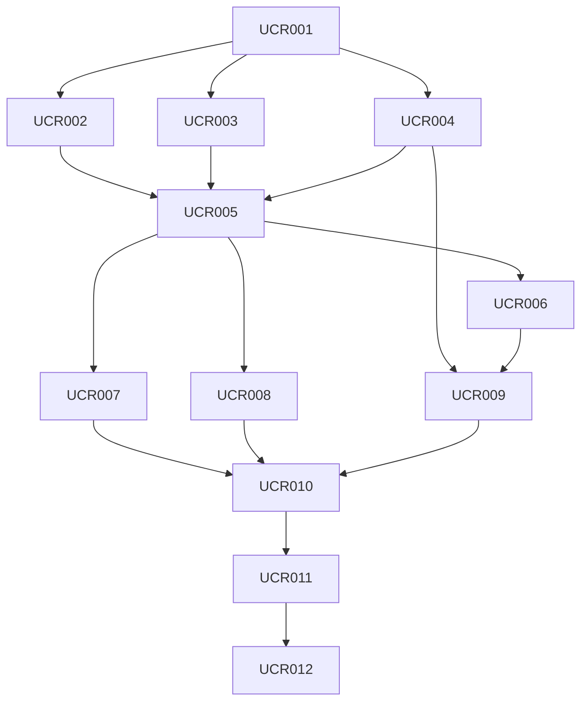

# UCR dependency graph freeze (S0)

This sprint freezes dependency order and execution constraints for UCR-001..UCR-012.

## Frozen order

## Critical path

- `UCR-001` is the only implementation-critical first move.
- `UCR-002` and `UCR-003` are parallel-safe **only** after explicit UCR-001 acceptance.
- `UCR-004` remains in Security/Governance lane after UCR-001 acceptance.
- Campus/UI runtime-claim surfaces remain blocked from authority assertions until reconciliation controls exist.

## Authority constraints across all dependencies

- No independent University truth store is permitted.
- Existing StarNet authority modules remain source facts:
  - runtime and events
  - capability resolution and consent
  - persistence and lineage
  - workflow routing
  - spend/budget/ledger
